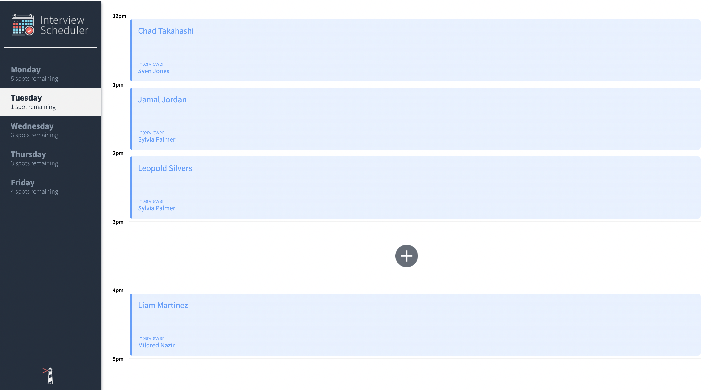
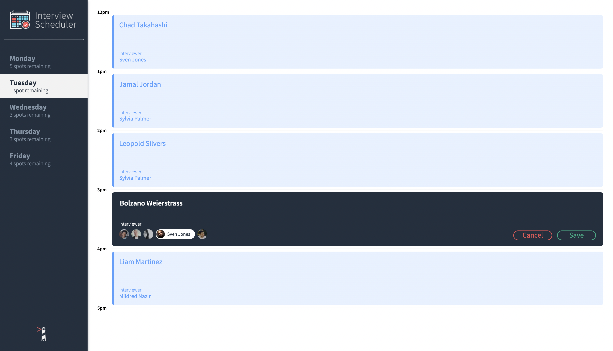
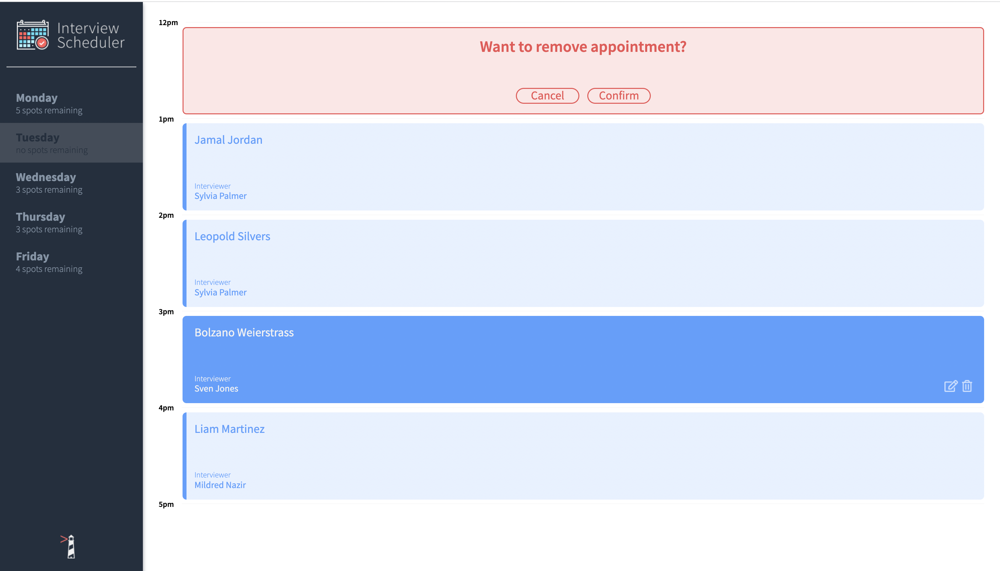
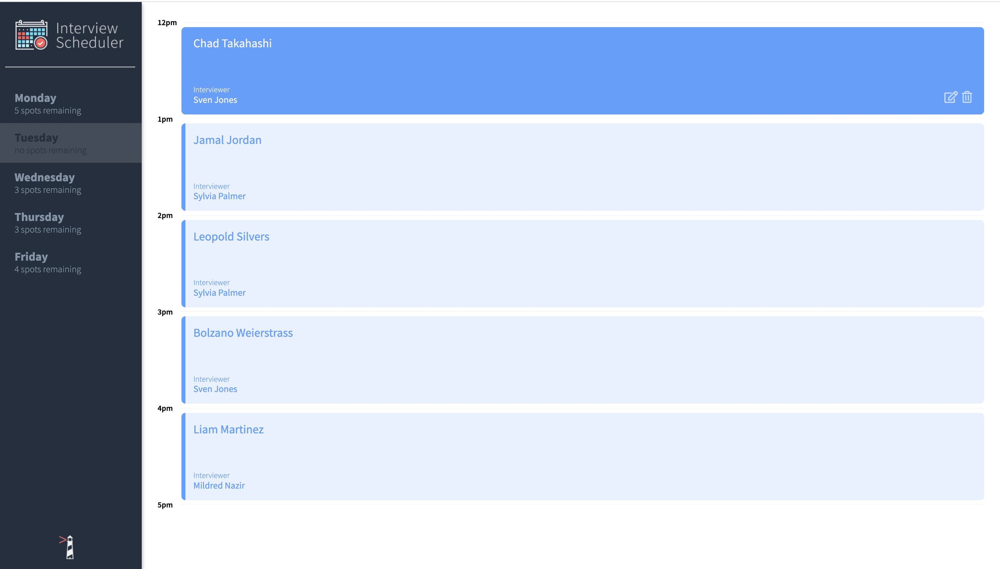
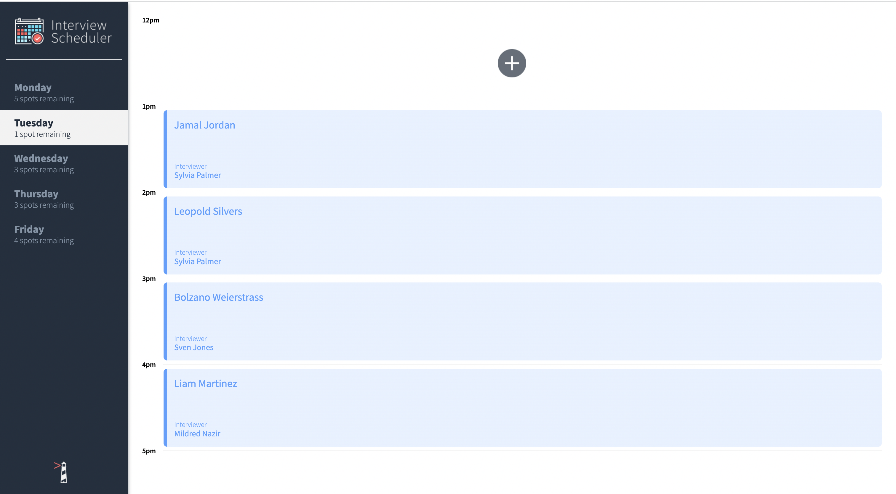

# Interview Scheduler
## Project Description

Interview Scheduler is a Single Page Application(SPA) built using React. It allows user to book, edit and delete appointments between Monday and Friday. 
Data is persisted by the API server using a PostgreSQL database. So, we do not lose data after a browser refresh. The client application communicates with an API server over HTTP, using the JSON format.
Also, for quality assurance, the project follows best practices of Test Driven Development (TDD). This includes individual Component tested in isolation using storybook and integrated testing of Components using Jest. The entire End-to-End testing is performed in cypress.

## Project Features
- Interviews can be booked between Monday and Friday, with five slots available per day.
- The list of days informs the user how many slots are available for each day.
- A user can book an interview in an empty appointment slot.
- Interviews are booked by typing in a student name and clicking on an interviewer from a list of available interviewers.
- A user can edit the details of an existing interview or cancel the interview
- The number of spots available when an interview is booked or canceled.
- A user is presented with a confirmation when they attempt to cancel an interview.
- A user is shown an error if an interview cannot be saved or deleted.
- A user is shown a status indicator while asynchronous operations are in progress.
- When the user presses the close button of the error they are returned to the Form or Show view (skipping Status and Confirm).

### App shows list of days and available interview spots

A user can choose any empty slot to book an appointment

### Enter a student name and select an interviewer from the list to book an appointment.

### Deleting an appointment

A user gets prompt to confirm before deleting an appointment

### Fully booked

Dynamic count notifies a user when no time available in an expected day.

### Appointment deleted from Tuesday, and remaining spots updated.

-App optimized user experience

## API server/Database Setup

For full functionality both must run concurrently: the client and the API server applications.
- Start by forking and cloning the scheduler-api server [here](https://github.com/lighthouse-labs/scheduler-api)
- Follow the steps outlined in README to install and setup the database
- Fork and clone this repo
- From the project root directory, install dependencies with `npm install`
- Then run `npm start`
- Once the setup is complete: database setup, the scheduler-api server running, and the node server running. View app on browser from local host.

## Project Tools

__Front-End:__ React, Axios, JSX, HTML, and JavaScript

__Back-End:__  Node.js, Express and PostgreSQL

__Testing:__ Storybook, Webpack Dev Server, Jest, Testing Libraries from Cypress

## Dependencies
- See package.json file for details.
